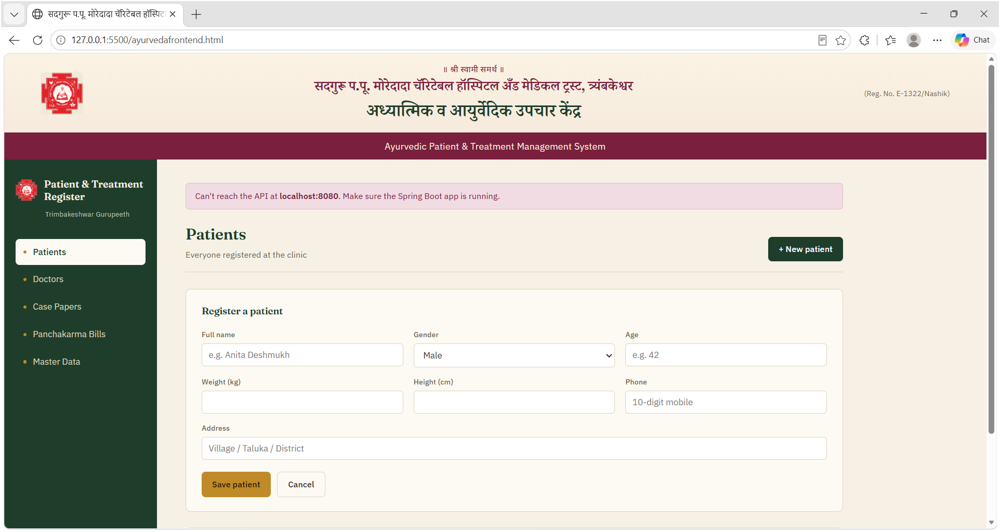
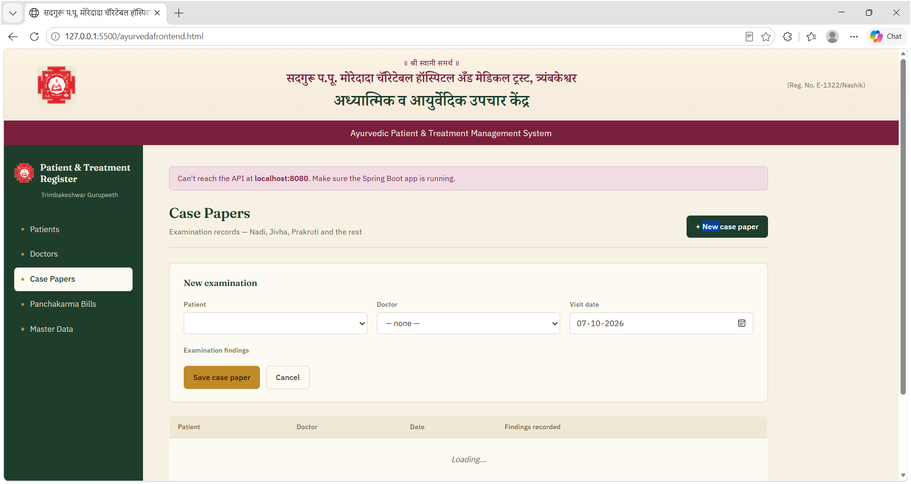
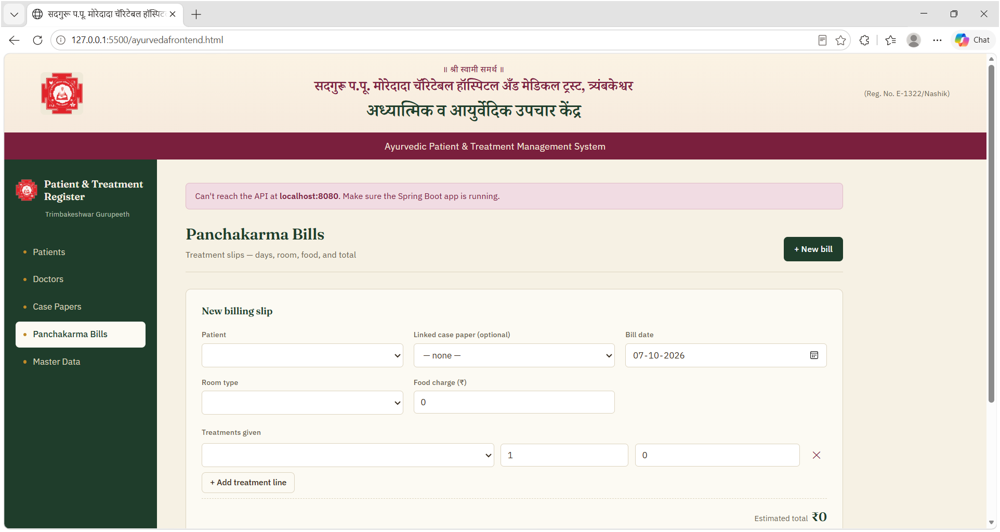

# Ayurveda Hospital Management System

**Java · Spring Boot · MySQL · REST API · HTML/CSS/JavaScript**

  
  
  
  
  
  
  

## Overview

Ayurveda Hospital Management System is a full-stack hospital workflow application for managing patients, doctors, case papers, examinations, Panchakarma treatments, and billing. The Spring Boot backend exposes REST APIs backed by MySQL, while the included browser interface supports the day-to-day hospital workflow.

## Application Screenshots

### Patient Registration

### Case Papers

### Panchakarma Bills

## Features

| Area | What it supports |
| --- | --- |
| Patient management | Create, view, update, and delete patient records with contact and basic health details. |
| Doctor management | Maintain doctor names, specializations, and contact details. |
| Case papers | Record a visit against a patient and doctor, with examination parameters, symptoms, and treatment notes. |
| Panchakarma billing | Create bills with treatment line items, room type, food charge, and a server-calculated total. |
| Master data | Manage treatment types, examination parameters, and room types. |
| Patient history | Retrieve visits and bills for a specific patient. |
| Error handling | Returns meaningful errors when a requested record does not exist. |

## Application workflow

1. Add doctors, room types, treatment types, and examination parameters.
2. Register a patient.
3. Create a case paper for the patient's visit and record examinations.
4. Add a Panchakarma bill with treatment items and charges.
5. Review the patient's visit and billing history.

## Technology stack

| Technology | Purpose |
| --- | --- |
| Java 17 | Application language |
| Spring Boot 3 | REST API and application framework |
| Spring Data JPA | Database access and entity mapping |
| MySQL | Relational database |
| Maven | Build and dependency management |
| HTML, CSS, JavaScript | Browser interface |

## Project structure

\`\`\`text
ayurveda-backend/
├── src/main/java/com/krupasindhu/ayurveda/
│   ├── controller/        # REST endpoints
│   ├── dto/               # Request models for visits and bills
│   ├── entity/            # JPA entities
│   ├── exception/         # Global error handling
│   ├── repository/        # Spring Data repositories
│   └── service/           # Visit and bill business logic
├── src/main/resources/
│   └── application.properties  # Local MySQL configuration — ignored by Git
├── ayurvedafrontend.html  # Browser interface
├── pom.xml                # Maven configuration
└── README.md
\`\`\`

## API overview

The API runs at \`http://localhost:8080\`.

| Resource | Base path | Operations |
| --- | --- | --- |
| Patients | \`/api/patients\` | Create, list, get by ID, update, delete |
| Doctors | \`/api/doctors\` | Create, list, get by ID, update, delete |
| Visits / case papers | \`/api/visits\` | Create, list, get by ID, delete, list by patient |
| Bills | \`/api/bills\` | Create, list, get by ID, delete, list by patient |
| Treatment types | \`/api/treatment-types\` | Create, list, get by ID, update, delete |
| Examination parameters | \`/api/examination-parameters\` | Create, list, get by ID, update, delete |
| Room types | \`/api/room-types\` | Create, list, get by ID, update, delete |

### Useful endpoints

\`\`\`text
GET    /api/patients
POST   /api/patients
PUT    /api/patients/{id}
DELETE /api/patients/{id}

GET    /api/visits/patient/{patientId}
POST   /api/visits

GET    /api/bills/patient/{patientId}
POST   /api/bills
\`\`\`

The bill total is calculated on the server from the treatment-line-item amounts plus the food charge.

## Getting started

### Prerequisites

- JDK 17 or later
- MySQL Server
- Maven
- An IDE such as IntelliJ IDEA, Eclipse, or VS Code with Java support

### 1. Clone the repository

\`\`\`bash
git clone https://github.com/samruddhi-mahale/Ayurvedic_Hospital_Management_System_.git
cd Ayurvedic_Hospital_Management_System_
\`\`\`

### 2. Create the database

In MySQL Workbench or the MySQL command line, create the database:

\`\`\`sql
CREATE DATABASE ayurveda_clinic;
\`\`\`

### 3. Configure your local database connection

Create \`src/main/resources/application.properties\` and add your own MySQL credentials:

\`\`\`properties
spring.datasource.url=jdbc:mysql://localhost:3306/ayurveda_clinic?useSSL=false&allowPublicKeyRetrieval=true&serverTimezone=UTC
spring.datasource.username=root
spring.datasource.password=your_mysql_password

spring.jpa.hibernate.ddl-auto=update
spring.jpa.show-sql=true
server.port=8080
\`\`\`

This file is intentionally ignored by Git. Do not commit database passwords or other local credentials.

### 4. Run the backend

\`\`\`bash
mvn spring-boot:run
\`\`\`

The REST API will start at \`http://localhost:8080\`. With \`spring.jpa.hibernate.ddl-auto=update\`, Hibernate creates or updates the mapped tables in the database.

### 5. Open the frontend

After the backend is running, open \`ayurvedafrontend.html\` in a browser to use the patient, doctor, case-paper, billing, and master-data screens.

## Example request: create a case paper

\`\`\`json
{
  "patientId": 1,
  "doctorId": 1,
  "visitDate": "2026-09-05",
  "examinations": [
    {
      "parameterId": 1,
      "symptoms": "Irregular",
      "treatmentNotes": "Monitor"
    }
  ]
}
\`\`\`

Send this request to \`POST /api/visits\`.

## Example request: create a bill

\`\`\`json
{
  "patientId": 1,
  "visitId": 1,
  "roomTypeId": 2,
  "billDate": "2026-09-05",
  "foodCharge": 300,
  "items": [
    {
      "treatmentTypeId": 1,
      "days": 7,
      "amount": 3500
    }
  ]
}
\`\`\`

Send this request to \`POST /api/bills\`.

## Future improvements

- Add authentication and role-based access for hospital staff.
- Add API documentation with Swagger / OpenAPI.
- Add automated tests for services and controllers.
- Add invoice printing and export features.
- Add appointment scheduling and reporting.

## Author

**Samruddhi Mahale** 
Java Developer
